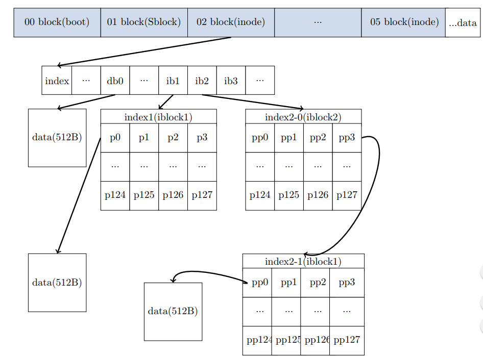

# README

## Problem Analysis

A file system with multi indexes is a little bit complex. Firstly, the **boot block** is related to the OS launch and **super block** is used to store info about the file system's size, management block's initial address and data block's initial address. How a index finds the data block is following the picture below.
 

The data is divided into several blocks:

- dblock points to a data block
- iblocks[i] points to a management block(in the block, every byte is a pointer that can point to a data block)
- i2block points to a management block(in the block, every byte is a pointer that can point to a iblock1 block), then recursively find the data block.
- i3block points to a management block(in the block, every byte is a pointer that can point to a iblock2 block), then recursively find the data block.

When we get all the data blocks of a file, we shall reorder them in the file image. It's a reverse process of the find data blocks:

1. put the data blocks in the file
2. every dblock[i] points to a block
      - if enough: end
3. put all pointers(except dblock[i]'s ; every pointer is 4B) in the file,every iblock[i] points to a block pointers
      - if enough: end
4. put all pointer-pointers(except iblock[i]'s ; every pointer is 4B) in the file, i2block points to a block full of pointer-pointers
      - if enough: end
4. put all pointer-pointer-pointers(except iblock[i]'s ; every pointer is 4B) in the file,iblock points to a block full of pointer-pointer-pointers

***
***

## Data Structure

### Read Superblock:

**struct Superblock** includes info:

    int size; /* size of blocks in bytes */
    int inode_offset; /* offset of inode region in bytes blocks */
    int data_offset; /* data region offset in blocks */
    int swap_offset; /* swap region offset in blocks */
    int free_inode; /* head of free inode list */
    int free_iblock; /* head of free block list */

In structure: **size**, **inode_offset**, **data_offset** is useful

After defragmentation, the ***free_iblock*** should be changed.

***

### Read inode:

**struct Inode** includes:

    typedef struct __inode 
    {
        int next_inode; /* list for free inodes */
        int size;
        ...
        int dblocks[N_DBLOCKS]; /* pointers to data blocks */
        int iblocks[N_IBLOCKS]; /* pointers to indirect blocks */
        int i2block; /* pointer to doubly indirect block */
        int i3block; /* pointer to triply indirect block */
    }Inode

In structure:**size**, **next_inode**, **dblocks**,**iblocks**,**i2block**,**i3block** is useful

After defragmentation, the ***dblocks,iblocks,i2block,i3block*** should be changed.

***

### global Information

    struct FSenv             //file system   environment
    {
	   int inode_offset;     //in the unit of BLOCKSIZE
	   int data_offset;      //in the unit of BLOCKSIZE
	   int node_region_size; //in the unit of sizeof(Inode)
	   int file_piece_num;   //record which file piece now is in the unit of BLOCKSIZE
	   int block_size;
	   int all_used;         //in the unit of BLOCKS
    }FSenv

***

### datablocks

Every data block stores the data of a piece of a file

    typedef struct __datablock  //data block's details
    {
    	int num;                //for debug
    	int block_num;          //for debug
    	int offset;             //datablock offset
    	int buffer[BLOCKSIZE/4];//store the block from disk into memory
    }datablock

***
***

## functions

### Direct_Block

It is used to read blocks from file to the `datablock` structure. The data is all real data(not for management use like index node etc. There're 2 ways to read files: 

1. from beginning
2. from the last visited place
    
Magnetic arm movement distance(last time visit place:a, target place:b):

way1:$$|a+b|$$
way2:$$|a-b|$$

Since both a and b are positive ***way2*** is always a better way. Here's simplified code:
    void Direct_Block(datablock* db,int* IdrctBlck, FILE*f, int length,int *wholeNum)
    {
        fseek(f,(IdrctBlck[i] + FSenv.data_offset)*BLOCKSIZE,SEEK_SET);
    	fread(db->buffer,BLOCKSIZE,1,f);
    	db = db + 1;
    	for(i=1 ;i<length;i++)
    	{
    		fseek(f,(IdrctBlck[i]- IdrctBlck[i-1] -1)*BLOCKSIZE,SEEK_CUR);
    		fread(db->buffer,BLOCKSIZE,1,f);
    	}
    }
    
---

### Indirect_Block(i)

Actually <u>Indirecto_Block1</u>,<u>Indirecto_Block2</u>,<u>Indirecto_Block3</u> can be rewritten to aone recursive function. It's used to find its block's pointer's pointer-to-blocks. And the end is the data block. Here's the simplified code:

    void Indirect_Block1(datablock* db,int* IdrctBlck, FILE*f, int length,int *wholeNum)
    {
	   for(i=0; i<length; i++)
	   {
	   	   int *newblock = (int*)malloc(1+BLOCKSIZE);
	   	   fseek(f,(IdrctBlck[i] + FSenv.data_offset)*BLOCKSIZE,SEEK_SET);
	   	   fread(newblock, BLOCKSIZE, 1, f);
		   Direct_Block(db, newblock, f, BLOCKSIZE/4, wholeNum);
		   free(newblock);
	   }
	}

***

### Write_blocks

Every time the function is called, it pushes all the **current blocks** into the datafile and merges the excess blocks(beyond current index's management) to a new index. To be more universal, we need to pass 2 redundant paras called *bound* and *type*. *bound* is used tell the index's capacity while the *type* is used to tell the index's layer. Here's the simplified code:

    int Write_blocks(Inode* ind, datablock* indb, datablock** outDb, int length, FILE* inodeFile, FILE* setFile,FILE* onlyFile, int bound,int type)
    {
	*outDb = NULL;
	if(indb == NULL || length ==0)
	{
		return 0;
	}
	int iiter = 0;
	int diter = 0;
	datablock* tempDb = NULL;
	for(int i=0; i < length; i++)
	{
		fwrite((indb[i]).buffer, BLOCKSIZE, 1, setFile);
		if(type == TYPE_DBLOCKS)
			fwrite((indb[i]).buffer, BLOCKSIZE, 1, onlyFile);
		if(!iiter)                                   //blocks are enough to handle with current index
		{
			if(type == TYPE_DBLOCKS)
				ind->dblocks[diter] = FSenv.all_used;
			else if(type == TYPE_IBLOCKS)
				ind->iblocks[diter] = FSenv.all_used;
			else if(type == TYPE_I2BLOCKS)
				ind->i2block = FSenv.all_used;
			else if(type == TYPE_I3BLOCKS)
				ind->i3block = FSenv.all_used;

			diter++;
			if(diter == bound && (i+1) != length)
			{
				diter = 0;
				iiter = 1;
				tempDb = malloc(sizeof(datablock));
				memset(tempDb,0,sizeof(datablock));
			}
		}                                            //need upper layer index
		else
		{
			if(diter == (BLOCKSIZE/sizeof(int)))
			{
				diter = 0;
				iiter ++;
				tempDb = realloc(tempDb, iiter * sizeof(datablock));
				memset(tempDb+iiter-1,0,sizeof(datablock));
			}
			(tempDb[iiter-1]).buffer[diter] = FSenv.all_used;
			diter++;
			if(diter != (BLOCKSIZE/sizeof(int)))
				(tempDb[iiter-1]).buffer[diter] = -1;
		}
		FSenv.all_used +=1;
	}
	*outDb = tempDb;
	return iiter;
    }

***

### Other function

As for <u>FSwirte</u> and <u>MergeFile</u>, they're simple. 

1. ***FSwrite*** is used to call <u>Write_Block</u> layer by layer until all blocks are managed.   
2. ***MergeFile(a,b)*** merge file b to file a 

***
***

